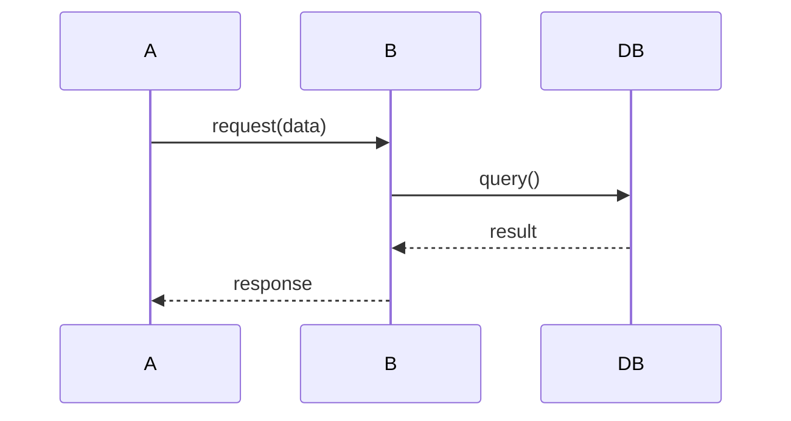

# codefind-summarize

Generate summaries and documentation from indexed code using semantic search.

## Description

This skill helps AI agents create summaries, documentation, and explanations of code sections by leveraging codefind's semantic search capabilities. It's useful for understanding unfamiliar codebases, generating documentation, and explaining component relationships.

## When to Use

Use this skill when you need to:
- Understand what a function or module does
- Generate documentation for code sections
- Explain relationships between components
- Create architecture documentation
- Document API endpoints and their behavior
- Summarize changes in a codebase
- Explain code patterns to team members
- Generate README or wiki content

## Prerequisites

- Project(s) indexed with `codefind index`
- Understanding of what code section needs summarization
- Access to the code files for detailed analysis

## Usage

### Summarization Workflow

1. **Identify what to summarize**
   - Module, package, or feature area
   - Specific function or class
   - Architectural component

2. **Search for relevant code**
   ```bash
   codefind query "description of what you're summarizing"
   ```

3. **Read the code**
   - Use codefind results to identify files
   - Read files to understand implementation
   - Find related code (tests, configs, docs)

4. **Analyze relationships**
   - Find what calls this code
   - Find what this code depends on
   - Understand data flow

5. **Generate summary**
   - Describe what it does (purpose)
   - Explain how it works (mechanism)
   - Note key dependencies
   - Document usage examples

## Summarization Types

### Function Summary

**Goal:** Explain what a function does and how to use it

**Steps:**
1. Find the function:
   ```bash
   codefind query "function_name implementation" --project="MyProject"
   ```

2. Read implementation and find:
   - Input parameters and types
   - Return values
   - Side effects
   - Error conditions

3. Find usage examples:
   ```bash
   codefind query "call function_name example" --project="MyProject"
   ```

4. Find tests:
   ```bash
   codefind query "test function_name" --project="MyProject"
   ```

**Summary Template:**
```markdown
## function_name

**Purpose:** [What it does in one sentence]

**Parameters:**
- param1: [type] - [description]
- param2: [type] - [description]

**Returns:** [type] - [description]

**Usage Example:**
[code example from codebase or tests]

**Error Handling:**
- Raises/Returns [error] when [condition]

**Dependencies:**
- [library/module] - [why needed]
```

### Module/Package Summary

**Goal:** Document a module's purpose and exports

**Steps:**
1. Find module code:
   ```bash
   codefind query "module_name package" --project="MyProject"
   ```

2. Find all exports:
   ```bash
   codefind query "module_name export public API" --project="MyProject"
   ```

3. Find usage:
   ```bash
   codefind query "import module_name use" --all
   ```

**Summary Template:**
```markdown
## module_name

**Purpose:** [What this module provides]

**Key Components:**
- **ComponentA**: [brief description]
- **ComponentB**: [brief description]

**Main Exports:**
- `function_name()` - [what it does]
- `ClassName` - [what it represents]

**Usage:**
[common usage patterns from codebase]

**Dependencies:**
[external libraries used]
```

### Component Relationship Documentation

**Goal:** Explain how components interact

**Steps:**
1. Find component A:
   ```bash
   codefind query "component A implementation" --project="MyProject"
   ```

2. Find component B:
   ```bash
   codefind query "component B implementation" --project="MyProject"
   ```

3. Find interactions:
   ```bash
   codefind query "component A calls component B" --project="MyProject"
   ```

4. Understand data flow:
   - What data flows from A to B?
   - What triggers the interaction?
   - What happens next?

**Summary Template:**
```markdown
## Component Interaction: A ↔ B

**Overview:** [High-level description of interaction]

**Data Flow:**
1. [Component A] receives [input]
2. [Component A] processes and calls [Component B]
3. [Component B] performs [action]
4. [Component B] returns [result]
5. [Component A] handles [result]

**Sequence:**


**Key Functions:**
- `A.process()` - Initiates interaction
- `B.handle()` - Processes request
```

## Examples

### Example 1: Summarize Authentication Flow

**Step 1: Find auth entry point**
```bash
codefind query "authentication login endpoint" --project="API"
```

**Result:**
```
1. [API] src/handlers/auth.py:45-80
   Function: login_handler
   Handles user login requests
```

**Step 2: Find auth validation**
```bash
codefind query "validate credentials password check" --project="API"
```

**Step 3: Find token generation**
```bash
codefind query "generate JWT token claims" --project="API"
```

**Step 4: Create summary**
```markdown
## Authentication Flow

### Overview
User authentication is handled through JWT tokens. The system validates
credentials against the database and returns a signed JWT token.

### Flow
1. User submits credentials to `/api/login` endpoint
2. `login_handler()` validates input (src/handlers/auth.py:45)
3. `validate_credentials()` checks username/password (src/auth/validator.py:20)
4. If valid, `generate_jwt()` creates token with user claims (src/auth/jwt.py:15)
5. Token returned to client for subsequent requests

### Key Functions
- **login_handler()**: Entry point for authentication
- **validate_credentials()**: Verifies user credentials against database
- **generate_jwt()**: Creates signed JWT token with 24h expiration

### Security Features
- Password hashing using bcrypt
- JWT signed with RS256
- Token expiration enforced
- Rate limiting on login endpoint (5 attempts/minute)
```

### Example 2: Document API Endpoints

**Step 1: Find all endpoints**
```bash
codefind query "API route endpoint handler" --project="API" --path=routes
```

**Step 2: For each endpoint, find implementation**
```bash
codefind query "users endpoint GET POST" --project="API"
```

**Step 3: Find request/response schemas**
```bash
codefind query "user schema validation request response" --project="API"
```

**Step 4: Create API documentation**
```markdown
## API Endpoints

### Users

#### GET /api/users
**Purpose:** List all users

**Query Parameters:**
- `page`: int - Page number (default: 1)
- `limit`: int - Results per page (default: 20)

**Response:** 200 OK
```json
{
  "users": [{"id": 1, "username": "john", "email": "john@example.com"}],
  "page": 1,
  "total": 45
}
```

**Implementation:** `src/handlers/users.py:get_users()`

#### POST /api/users
**Purpose:** Create new user

**Request Body:**
```json
{
  "username": "string (required, 3-20 chars)",
  "email": "string (required, valid email)",
  "password": "string (required, min 8 chars)"
}
```

**Response:** 201 Created
**Implementation:** `src/handlers/users.py:create_user()`
```

### Example 3: Explain Error Handling Strategy

**Step 1: Find error handling code**
```bash
codefind query "error handling custom errors" --project="MyApp"
```

**Step 2: Find error types**
```bash
codefind query "error class exception types" --project="MyApp"
```

**Step 3: Find error middleware**
```bash
codefind query "error middleware exception handler" --project="MyApp"
```

**Step 4: Document strategy**
```markdown
## Error Handling Strategy

### Overview
The application uses a centralized error handling system with custom
error types and structured logging.

### Error Types
- **ValidationError**: Invalid input data (400 Bad Request)
- **NotFoundError**: Resource not found (404 Not Found)
- **AuthenticationError**: Invalid credentials (401 Unauthorized)
- **PermissionError**: Insufficient permissions (403 Forbidden)
- **InternalError**: Server errors (500 Internal Server Error)

### Error Flow
1. Application code raises typed error
2. Error middleware catches exception (src/middleware/errors.py:20)
3. Error logged with context (user, request, stack trace)
4. Error converted to HTTP response with appropriate status code
5. Client receives structured error response

### Error Response Format
```json
{
  "error": {
    "code": "VALIDATION_ERROR",
    "message": "Invalid email format",
    "field": "email",
    "request_id": "abc-123"
  }
}
```

### Best Practices
- Always use typed errors (don't raise generic Exception)
- Include context in error messages
- Log errors with structured fields
- Return helpful error messages to clients
```

## Summarization Best Practices

1. **Start with search:**
   - Use codefind to find entry points
   - Search for related code
   - Find tests and examples

2. **Read the actual code:**
   - Don't just rely on search results
   - Read implementations in full
   - Check for edge cases and error handling

3. **Follow data flow:**
   - Understand inputs and outputs
   - Trace data transformations
   - Note side effects

4. **Find examples:**
   - Search for usage in tests
   - Find real usage in codebase
   - Include concrete examples in summary

5. **Check relationships:**
   - What depends on this?
   - What does this depend on?
   - How does it fit in the architecture?

6. **Be accurate:**
   - Verify claims by reading code
   - Don't assume based on names
   - Note what you're uncertain about

## Summary Templates

### Function Documentation
```markdown
## function_name

**Purpose:** [one-line description]
**Location:** [file:line]
**Parameters:** [list with types and descriptions]
**Returns:** [type and description]
**Side Effects:** [list any side effects]
**Example:** [code example]
```

### Class Documentation
```markdown
## ClassName

**Purpose:** [what this class represents]
**Location:** [file:line]
**Properties:** [key properties]
**Methods:** [key methods with brief descriptions]
**Usage:** [typical usage pattern]
**Related:** [related classes]
```

### Architecture Documentation
```markdown
## Component: [Name]

**Responsibility:** [what this component does]
**Location:** [directory/package]
**Key Files:** [list main files]
**Dependencies:** [what it depends on]
**Dependents:** [what depends on it]
**Data Flow:** [how data flows through]
**Configuration:** [how it's configured]
```

## Combining with Other Tools

After finding code with codefind:
- Use **Read** to get full file context
- Use **Grep** to find all references
- Use **Glob** to find related files
- Use **code-graph** skills to find callers/callees

## Related Skills

- **codefind-search**: For finding code to summarize
- **codefind-patterns**: For documenting common patterns
- **codefind-migrate**: For documenting migration changes
